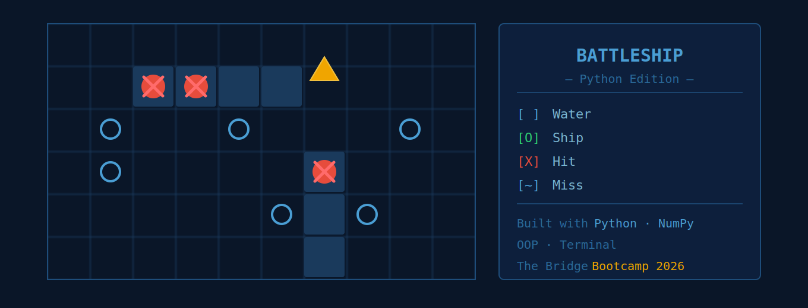

# Battleship Game (Batalla Naval)

A fully functional terminal-based **Battleship game** built in Python, developed as part of the **Data Science & IA Bootcamp at The Bridge**.

---

## Gameplay

The player faces off against an AI opponent that places its ships randomly on a **10x10 grid**.  
Sink all enemy ships before the AI sinks yours.

**Turn rules:**
- Hit a ship → you shoot again
- Miss → AI takes its turn

**In-game menu options:**
| Option | Action |
|--------|--------|
| 🎯 Shoot | Fire at enemy coordinates |
| 🗺️ Enemy board | View where you've already fired |
| 🛡️ My board | View your own board and ship positions |
| 🚪 Exit | Quit the game |

---

## Board Symbols

| Symbol | Meaning |
|--------|---------|
| `[ ]` | Water |
| `[O]` | Ship |
| `[X]` | Hit |
| `[~]` | Miss |

---

## Tech Stack


---

## Installation

```bash
git clone https://github.com/gianass-first/batalla_naval_python.git
cd batalla_naval_python
python main.py
```

